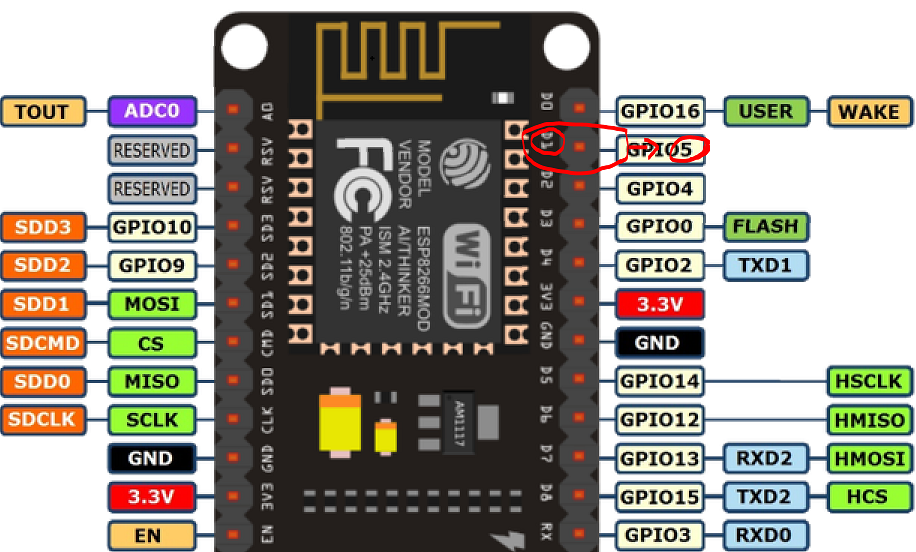
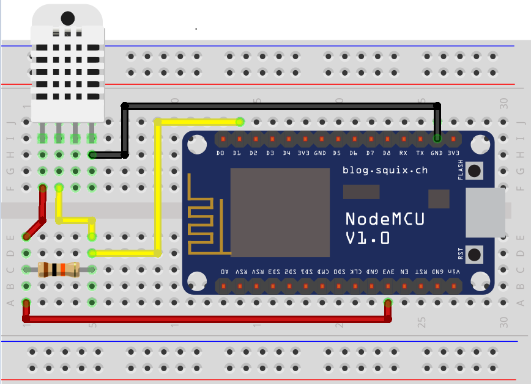

# IOT-NodeMCU
NodeMCU with DHT22 sensor, using Azure, Node Red and HiveMq

# IOT with Azure, Mqtt, Arduino, NodeMCU and Node Red tutorial part 1

NodeMCU PinOuts using D1 which = GPIO5

# IOT with Azure, Mqtt, Arduino, NodeMCU and Node Red tutorial part 2

<b style='color:red'>CODE for Arduino IDE:</b>
https://github.com/itchopshop/IOT-NodeMCU/blob/master/DHTtesterTutorialPart2/DHTtesterTutorialPart2.ino

https://www.arduino.cc/en/Main/Software ******** Arduino IDE

http://arduino.esp8266.com/stable/package_esp8266com_index.json ****** Additional Boards Manager URLs

https://github.com/adafruit/Adafruit_Sensor **** Main Sensor Library

<b style='color:red'>Change the following code in your Arduino C++ program to the below.</b>.

#define DHTPIN 5  // GPIO 15 (D1) ***** what digital pin we're connected to

# IOT with Azure, Mqtt, Arduino, NodeMCU and Node Red tutorial part 3

Azure subscription, VM set up in Azure, configuring end points and Node Red installation

https://azure.microsoft.com/en-us/free/ **** link to Azure subscription

http://nodered.org/docs/getting-started/installation.html **** Node-Red setup

https://www.java.com/en/download/windows-64bit.jsp ***** Java Install

https://nodejs.org/en/ ***** Node.js install

http://www.hivemq.com/try-out/ *** Tryout

Connect to Public Broker
Host: broker.hivemq.com
Port: 1883
Websocket Port: 8000
